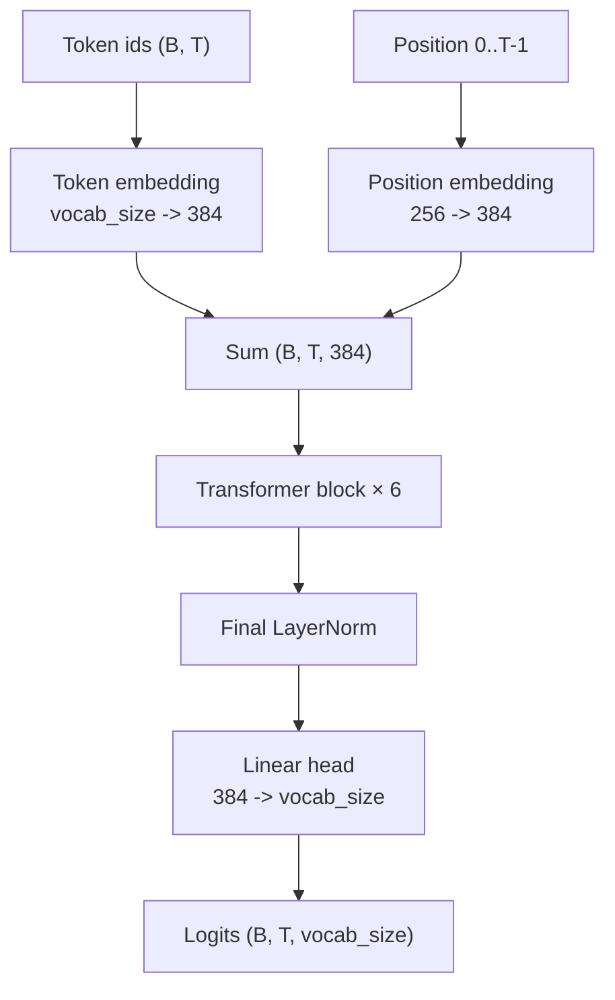

# GPT Model

This file documents the decoder-only Transformer implementation in [gpt.py](gpt.py). It focuses on the model architecture, the training setup, and the mechanics of autoregressive text generation in this single file.

The implementation is intentionally compact and readable. It demonstrates the core building blocks of a GPT-style language model: token embeddings, positional embeddings, causal self-attention, feed-forward layers, residual connections, layer normalization, and next-token prediction.

---

## Table of contents

1. [Overview](#overview)
2. [Quick start](#quick-start)
3. [Language modeling](#language-modeling)
4. [Hyperparameters](#hyperparameters)
5. [Data pipeline](#data-pipeline)
6. [Architecture](#architecture)
7. [Embeddings](#embeddings)
8. [Self-attention](#self-attention)
9. [Multi-head attention](#multi-head-attention)
10. [Feed-forward network](#feed-forward-network)
11. [Residual connections and layer normalization](#residual-connections-and-layer-normalization)
12. [Dropout](#dropout)
13. [Transformer block](#transformer-block)
14. [Full model](#full-model)
15. [Weight initialization](#weight-initialization)
16. [Loss function](#loss-function)
17. [Training loop](#training-loop)
18. [Evaluation](#evaluation)
19. [Training results](#training-results)
20. [Text generation](#text-generation)
21. [Tensor shape reference](#tensor-shape-reference)
22. [PyTorch concepts used](#pytorch-concepts-used)

---

## Overview

This implementation trains a small decoder-only Transformer on a text file and then samples new text from it. The model is intentionally compact, which makes it easier to inspect the architecture and understand how the pieces fit together.

| Property | Value in this code |
|---|---|
| Architecture | Decoder-only Transformer |
| Tokenization | Character-level |
| Layers (`n_layer`) | 6 |
| Attention heads (`n_head`) | 6 |
| Embedding width (`n_embd`) | 384 |
| Context window (`block_size`) | 256 |
| Normalization | Pre-LayerNorm + final LayerNorm |
| Activation | ReLU |
| Regularization | Dropout 0.2 |
| Parameters | 10.79M |
| Optimizer | AdamW |
| Framework | PyTorch |

The central task is simple: predict the next token from the preceding context and repeat that process to generate text.

---

## Quick start

### Requirements

- Python
- PyTorch
- A text file such as `input.txt` in the working directory

```bash
pip install torch
```

### Run

```bash
python gpt.py
```

The script prints training and validation loss during training and then generates text from a learned prompt context.

---

## Language modeling

### The task

A language model assigns a probability to a sequence of tokens $x_1, x_2, \dots, x_T$ using the chain rule:

```text
P(x_1, ..., x_T) = P(x_1) · P(x_2 | x_1) · P(x_3 | x_1, x_2) · ... · P(x_T | x_1, ..., x_{T-1})
```

The model predicts the next token at each position, producing a probability distribution over the vocabulary.

### Autoregressive generation

To generate text, the model is fed a prefix, the next-token distribution is computed, one token is sampled, and the token is appended to the prefix. This is repeated until the target length is reached.

### Teacher forcing

During training, the model is given the real prefix at each position and asked to predict the next token. Because of causal masking, all positions can be processed in parallel while still respecting the fact that each prediction depends only on earlier tokens.

---

## Hyperparameters

```python
batch_size    = 64
block_size    = 256
max_iters     = 6000
eval_interval = 500
learning_rate = 3e-4
eval_iters    = 200
n_embd        = 384
n_head        = 6
n_layer       = 6
dropout       = 0.2
```

| Name | Meaning |
|---|---|
| `batch_size` | Number of sequences processed per training step |
| `block_size` | Maximum context length |
| `max_iters` | Total optimization steps |
| `eval_interval` | Frequency of validation checks |
| `learning_rate` | Update size used by AdamW |
| `eval_iters` | Number of batches averaged for a loss estimate |
| `n_embd` | Embedding and residual-stream width |
| `n_head` | Number of attention heads |
| `n_layer` | Number of Transformer blocks |
| `dropout` | Regularization applied during training |

### Derived values

| Quantity | Value |
|---|---|
| Head size | 64 |
| FFN hidden width | 1536 |
| Tokens per training step | 16,384 |

---

## Data pipeline

### Reading the text

```python
with open("input.txt", "r", encoding="utf-8") as f:
    text = f.read()
```

The corpus is loaded as a Python string and converted to token IDs.

### Tokenization

```python
chars = sorted(list(set(text)))
vocab_size = len(chars)
stoi = {ch: i for i, ch in enumerate(chars)}
itos = {i: ch for i, ch in enumerate(chars)}

def encode(s):
    return [stoi[c] for c in s]

def decode(ids):
    return "".join([itos[i] for i in ids])
```

This is a character-level tokenizer: each character becomes a token ID, and the model works with integer indices instead of raw text.

### Train/validation split

```python
data = torch.tensor(encode(text), dtype=torch.long)
n = int(0.9 * len(data))
train_data = data[:n]
val_data = data[n:]
```

The first 90% of the data is used for training, and the last 10% is reserved for validation.

### Batching

```python
def get_batch(split):
    data = train_data if split == "train" else val_data
    ix = torch.randint(len(data) - block_size, (batch_size,))
    x = torch.stack([data[i : i + block_size] for i in ix])
    y = torch.stack([data[i + 1 : i + block_size + 1] for i in ix])
    x, y = x.to(device), y.to(device)
    return x, y
```

The model sees random context windows from the corpus. Each window is paired with the next-token target sequence shifted by one position.

---

## Architecture



The block structure is:

```text
x -> LayerNorm -> attention -> residual -> LayerNorm -> MLP -> residual
```

This is the standard pre-LayerNorm residual pattern used in GPT-style models.

---

## Embeddings

```python
self.token_embedding_table = nn.Embedding(vocab_size, n_embd)
self.position_embedding_table = nn.Embedding(block_size, n_embd)

tok_emb = self.token_embedding_table(idx)
pos_emb = self.position_embedding_table(torch.arange(T, device=device))
x = tok_emb + pos_emb
```

### Token embeddings

The token embedding table maps each token ID to a learned vector. Each character receives a trainable representation that the model can adjust during optimization.

### Positional embeddings

Self-attention does not, by itself, encode token order. Positional embeddings add information about each token's position in the sequence.

---

## Self-attention

The core operation is multi-position attention, where each token can look at earlier positions and decide which information matters most.

### Queries, keys, and values

```python
self.key   = nn.Linear(n_embd, head_size, bias=False)
self.query = nn.Linear(n_embd, head_size, bias=False)
self.value = nn.Linear(n_embd, head_size, bias=False)
```

- Query `q`: what a token is looking for
- Key `k`: what a token offers to others
- Value `v`: the content passed forward

### Forward pass

```python
B, T, C = x.shape
k = self.key(x)
q = self.query(x)
wei = q @ k.transpose(-2, -1) * k.shape[-1] ** -0.5
wei = wei.masked_fill(self.tril[:T, :T] == 0, float("-inf"))
wei = F.softmax(wei, dim=-1)
wei = self.dropout(wei)
v = self.value(x)
out = wei @ v
```

The attention matrix is masked so each token can only attend to itself and earlier positions. This preserves the autoregressive property required for text generation.

### Attention scaling

The dot products are divided by $\sqrt{\text{head\_size}}$ so the softmax remains well behaved rather than collapsing into a nearly one-hot distribution.

---

## Multi-head attention

```python
class MultiHeadAttention(nn.Module):
    def __init__(self, num_heads, head_size):
        super().__init__()
        self.heads = nn.ModuleList([Head(head_size) for _ in range(num_heads)])
        self.proj = nn.Linear(head_size * num_heads, n_embd)
        self.dropout = nn.Dropout(dropout)

    def forward(self, x):
        out = torch.cat([h(x) for h in self.heads], dim=-1)
        out = self.dropout(self.proj(out))
        return out
```

Using multiple heads lets the model attend to different patterns in parallel. Each head can focus on a different form of dependency within the same sequence.

---

## Feed-forward network

```python
class FeedFoward(nn.Module):
    def __init__(self, n_embd):
        super().__init__()
        self.net = nn.Sequential(
            nn.Linear(n_embd, 4 * n_embd),
            nn.ReLU(),
            nn.Linear(4 * n_embd, n_embd),
            nn.Dropout(dropout),
        )

    def forward(self, x):
        return self.net(x)
```

The feed-forward layer applies a non-linear transformation to each token independently. It complements self-attention by letting each position process its own representation before the next block.

---

## Residual connections and layer normalization

### Residual connections

```python
x = x + self.sa(self.ln1(x))
x = x + self.ffwd(self.ln2(x))
```

Residual connections allow the model to refine representations gradually rather than replace them entirely at each layer.

### Layer normalization

```python
self.ln1 = nn.LayerNorm(n_embd)
self.ln2 = nn.LayerNorm(n_embd)
self.ln_f = nn.LayerNorm(n_embd)
```

Layer normalization stabilizes activations by normalizing each token vector across its feature dimension.

---

## Dropout

Dropout is applied during training to reduce overfitting. It is used in the attention output projection and in the feed-forward sublayer.

The model switches between training and evaluation behavior using `model.train()` and `model.eval()`.

---

## Transformer block

```python
class Block(nn.Module):
    def __init__(self, n_embd, n_head):
        super().__init__()
        head_size = n_embd // n_head
        self.sa = MultiHeadAttention(n_head, head_size)
        self.ffwd = FeedFoward(n_embd)
        self.ln1 = nn.LayerNorm(n_embd)
        self.ln2 = nn.LayerNorm(n_embd)

    def forward(self, x):
        x = x + self.sa(self.ln1(x))
        x = x + self.ffwd(self.ln2(x))
        return x
```

Each block performs self-attention followed by a feed-forward update. The sequence of blocks is the repeated computational core of the model.

---

## Full model

```python
class GPTLanguageModel(nn.Module):
    def __init__(self):
        super().__init__()
        self.token_embedding_table = nn.Embedding(vocab_size, n_embd)
        self.position_embedding_table = nn.Embedding(block_size, n_embd)
        self.blocks = nn.Sequential(*[Block(n_embd, n_head=n_head) for _ in range(n_layer)])
        self.ln_f = nn.LayerNorm(n_embd)
        self.lm_head = nn.Linear(n_embd, vocab_size)
        self.apply(self._init_weights)
```

### Components

| Component | Purpose |
|---|---|
| Token embedding table | Maps token IDs to learned vectors |
| Position embedding table | Adds positional information |
| Transformer blocks | Repeated attention and feed-forward processing |
| Final layer norm | Normalizes the final representation |
| Output head | Produces logits for next-token prediction |

### Forward pass

```python
B, T = idx.shape
tok_emb = self.token_embedding_table(idx)
pos_emb = self.position_embedding_table(torch.arange(T, device=device))
x = tok_emb + pos_emb
x = self.blocks(x)
x = self.ln_f(x)
logits = self.lm_head(x)
```

The output `logits` contains one score per possible next character for each position in the sequence.

---

## Weight initialization

```python
def _init_weights(self, module):
    if isinstance(module, nn.Linear):
        torch.nn.init.normal_(module.weight, mean=0.0, std=0.02)
        if module.bias is not None:
            torch.nn.init.zeros_(module.bias)
    elif isinstance(module, nn.Embedding):
        torch.nn.init.normal_(module.weight, mean=0.0, std=0.02)
```

This initialization keeps the activations and gradients in a stable range at the start of training.

---

## Loss function

```python
loss = F.cross_entropy(logits, targets)
```

The model minimizes the average negative log-likelihood of the true next character. `F.cross_entropy` handles the softmax and loss computation in a numerically stable way.

The logits are flattened from `(B, T, V)` to `(B*T, V)` for training, while the target tensor is flattened to `(B*T,)`.

---

## Training loop

```python
model = GPTLanguageModel()
m = model.to(device)

optimizer = torch.optim.AdamW(model.parameters(), lr=learning_rate)

for iter in range(max_iters):
    xb, yb = get_batch("train")
    logits, loss = model(xb, yb)
    optimizer.zero_grad(set_to_none=True)
    loss.backward()
    optimizer.step()
```

Each step performs the standard training sequence:

1. sample a mini-batch
2. compute predictions and the loss
3. clear gradients
4. backpropagate
5. update parameters with AdamW

AdamW is used because it combines adaptive learning rates with decoupled weight decay, which is a common choice for Transformer training.

---

## Evaluation

```python
@torch.no_grad()
def estimate_loss():
    out = {}
    model.eval()
    for split in ["train", "val"]:
        losses = torch.zeros(eval_iters)
        for k in range(eval_iters):
            X, Y = get_batch(split)
            logits, loss = model(X, Y)
            losses[k] = loss.item()
        out[split] = losses.mean()
    model.train()
    return out
```

This helper measures the model's performance on both training and validation data without building a gradient graph.

---

## Training results

The model was trained for 6,000 optimization steps using the hyperparameters described above. The training and validation losses were recorded every 500 steps.

| Step | Train loss | Validation loss |
|---:|---:|---:|
| 0 | 4.2221 | 4.2306 |
| 500 | 1.7605 | 1.9158 |
| 1000 | 1.3966 | 1.6061 |
| 1500 | 1.2679 | 1.5315 |
| 2000 | 1.1839 | 1.4976 |
| 2500 | 1.1252 | 1.4955 |
| 3000 | 1.0716 | 1.4844 |
| 3500 | 1.0169 | 1.5053 |
| 4000 | 0.9604 | 1.5085 |
| 4500 | 0.9153 | 1.5366 |
| 5000 | 0.8598 | 1.5588 |
| 5500 | 0.8092 | 1.6026 |
| 5999 | 0.7560 | 1.6252 |

### Training observations

The training loss decreased consistently from `4.2221` to `0.7560`, showing that the model successfully learned patterns from the training corpus.

The validation loss decreased from `4.2306` to a minimum of `1.4844` at step `3000`. After this point, the validation loss began to increase while the training loss continued to decrease. This indicates that the model began to overfit the training data after approximately 3,000 steps.

The lowest recorded validation loss was:

```text
Step: 3000
Train loss: 1.0716
Validation loss: 1.4844
```

The final checkpoint at step 5999 achieved a lower training loss of 0.7560, but its validation loss increased to 1.6252.

The overfitting statement is directly supported by the loss trajectory, particularly the divergence after step 3000. The existing README explains that validation loss is estimated separately from training loss, so this section builds naturally on that.

### Sample output

After training, the model generated the following sample text:

```text
The maintail of me condusion; let us go.  LEONTES: I thought then did I wish from the city, but To save them Rutland too: prepare thee, Romeo, That apering thou hast but stolen To coid with in all us boltes, as are comforted Where thee grains post untitle, revenge then and To unpitude death to chats, and vain will freel.

CLARENCE: Methought thy hurt Did set me to me grace and tell me well, By y crowned love I need I do come: I will not bite a great night by lenity Hour of my head for temper to
```

The generated text shows that the model has learned corpus-specific character-level patterns, including dialogue formatting and character-name-like tokens. However, the output is still noisy and contains malformed words and inconsistent sentences, which is expected for a small character-level Transformer trained for a limited number of steps.

Because validation loss reached its minimum around step 3000 and increased afterward, the checkpoint corresponding to the lower validation loss may produce better generalization than the final training checkpoint.

---

## Text generation

```python
def generate(self, idx, max_new_tokens):
    for _ in range(max_new_tokens):
        idx_cond = idx[:, -block_size:]
        logits, loss = self(idx_cond)
        logits = logits[:, -1, :]
        probs = F.softmax(logits, dim=-1)
        idx_next = torch.multinomial(probs, num_samples=1)
        idx = torch.cat((idx, idx_next), dim=1)
    return idx
```

This function performs autoregressive generation. It predicts the next token, samples one value from the probability distribution, appends it to the current context, and repeats until the requested length is reached.

### Starting context

```python
context = torch.zeros((1, 1), dtype=torch.long, device=device)
print(decode(m.generate(context, max_new_tokens=500)[0].tolist()))
```

The generation can start from a blank context or from a short prompt, depending on the desired behavior.

---

## Tensor shape reference

`B` = batch size, `T` = sequence length, `C` = `n_embd`, `hs` = head size, `V` = vocabulary size.

| Tensor | Shape |
|---|---|
| `idx`, `targets` | `(B, T)` |
| `tok_emb` | `(B, T, C)` |
| `pos_emb` | `(T, C)` |
| Residual stream `x` | `(B, T, C)` |
| `q`, `k`, `v` (one head) | `(B, T, hs)` |
| Attention weights `wei` | `(B, T, T)` |
| One head output | `(B, T, hs)` |
| Concatenated heads | `(B, T, n_head · hs)` |
| FFN hidden | `(B, T, 4C)` |
| `logits` | `(B, T, V)` |
| `loss` | scalar |

---

## PyTorch concepts used

| API / concept | Role in the code |
|---|---|
| `torch.tensor(..., dtype=torch.long)` | Creates integer token IDs |
| `torch.randint` | Random batch sampling |
| `torch.stack` | Builds batch tensors |
| `.to(device)` | Moves data to CPU or GPU |
| `nn.Module` | Base class for model components |
| `nn.Linear` | Learned projections |
| `nn.Embedding` | Token and position lookup tables |
| `nn.LayerNorm` | Normalization per token |
| `nn.Dropout` | Regularization |
| `nn.ReLU` | Non-linearity in the feed-forward block |
| `nn.Sequential` | Chains modules in order |
| `nn.ModuleList` | Registers a list of submodules |
| `register_buffer` | Keeps non-trainable tensors with the module |
| `F.softmax` | Converts logits into probabilities |
| `torch.matmul` / `@` | Matrix multiplication used in attention |
| `F.cross_entropy` | Loss for next-token predictions |
| `optimizer.zero_grad` | Clears old gradients |
| `loss.backward` | Computes gradients |
| `optimizer.step` | Applies parameter updates |
| `model.train()` / `model.eval()` | Switches training and inference behavior |
| `torch.multinomial` | Sampling from probabilities |

---
