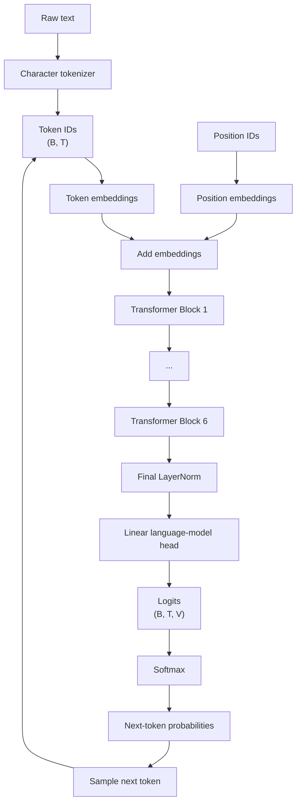

# GPT_from_scratch

A small, readable implementation of a **GPT-style language model built from scratch with PyTorch**.

The goal of this repository is not to reproduce a production-scale LLM. Instead, it is to make the core ideas behind GPT visible: how text becomes tokens, how a model learns to predict the next token, how self-attention lets tokens use earlier context, and how repeated predictions become generated text.

> **Learning path:** start with the bigram model, see how it learns next-token prediction, then move to the notebook for the intuition behind attention, and finally inspect the complete decoder-only Transformer implementation.

---

## What is GPT, in one idea?

At its core, GPT is an **autoregressive language model**.

Given a sequence of tokens

$$
x_1, x_2, \ldots, x_{t-1},
$$

the model predicts a probability distribution for the next token:

$$
P(x_t \mid x_1, x_2, \ldots, x_{t-1}).
$$

It then samples or selects one token, appends it to the sequence, and repeats the process:

```text
Context → Predict next token → Append token → Predict again → ...
```

This simple loop is the foundation of autoregressive text generation.

The model learns by maximizing the probability of the observed next tokens, or equivalently minimizing **cross-entropy / negative log-likelihood**:

$$
\mathcal{L}
=
-\frac{1}{T}
\sum_{t=1}^{T}
\log P_\theta(x_t \mid x_{<t}).
$$

---

## From a bigram model to GPT

This repository is organized as a progression rather than a single giant model.

| Stage | What it teaches | Deep dive |
|---|---|---|
| **Bigram model** | Next-token prediction with only the previous character as context | [`README_Bigram.md`](README_Bigram.md) |
| **GPT notebook** | Tokenization, context windows, embeddings, attention, masking, and generation | [`README_gpt-dev.md`](README_gpt-dev.md) |
| **GPT model** | A complete decoder-only Transformer implemented in PyTorch | [`README_gpt.md`](README_gpt.md) |

The progression is intentional:

```text
Bigram
  ↓
Learn next-token prediction
  ↓
Understand context and weighted aggregation
  ↓
Introduce causal self-attention
  ↓
Stack Transformer blocks
  ↓
GPT-style autoregressive language model
```

---

## The GPT architecture used here

The main implementation in `gpt.py` is a **decoder-only Transformer** with:

- character-level tokenization
- token embeddings
- learned positional embeddings
- 6 Transformer blocks
- 6 attention heads per block
- embedding dimension of 384
- context window of 256 characters
- causal (masked) self-attention
- feed-forward networks
- residual connections
- LayerNorm
- dropout
- a final linear language-model head

These details correspond to the implementation documented in [`README_gpt.md`](README_gpt.md).

### High-level data flow



A useful way to think about each Transformer block is:

```text
x
│
├── LayerNorm
├── Causal Self-Attention
├── Residual Add
│
├── LayerNorm
├── Feed-Forward Network
├── Residual Add
│
└── output
```

The complete implementation uses this pattern repeatedly across the stack.

---

## What makes self-attention important?

A bigram model only sees the immediately previous character:

$$
P(x_t \mid x_{t-1}).
$$

GPT-style attention can use the entire available context:

$$
P(x_t \mid x_1, x_2, \ldots, x_{t-1}).
$$

Self-attention does this by projecting token representations into **queries, keys, and values**:

$$
Q = XW_Q,\qquad
K = XW_K,\qquad
V = XW_V.
$$

The attention operation is

$$
\mathrm{Attention}(Q,K,V)
=
\mathrm{softmax}
\left(
\frac{QK^\top}{\sqrt{d_k}} + M
\right)V,
$$

where $M$ is the **causal mask**. Positions in the future are masked so that a token cannot use information that would not yet exist during generation.

Conceptually:

```text
Current token
     │
     ├── Query ──────┐
     │               │ compare
Earlier tokens       │
     │               ▼
     ├── Keys ───→ Attention weights
     │               │
     └── Values ─────┘
                     │
                     ▼
              Context-aware representation
```

The notebook [`gpt-dev.ipynb`](gpt-dev.ipynb), documented in [`README_gpt-dev.md`](README_gpt-dev.md), builds toward this idea step by step.

---

## From attention weights to probabilities

The model ultimately produces **logits**: unnormalized scores for every possible next token.

For logits $z_1,\ldots,z_V$, softmax converts them into probabilities:

$$
p_i
=
\frac{e^{z_i}}
{\sum_{j=1}^{V} e^{z_j}}.
$$

The training target is the actual next token. Cross-entropy encourages the model to place higher probability on that correct token.

During generation, the model can sample from the resulting distribution:

```text
logits
  ↓
softmax
  ↓
probability distribution
  ↓
sample one token
  ↓
append token to context
  ↓
repeat
```

---

## Training vs. generation

### During training

The model receives many context/target pairs at once:

```text
Input:  A B C D E
Target: B C D E F
```

For a sequence of length $T$, all next-token predictions can be trained in parallel because the causal mask prevents each position from seeing future tokens.

The training loop is the standard PyTorch pattern:

```text
sample batch
    ↓
forward pass
    ↓
calculate loss
    ↓
backpropagation
    ↓
update parameters
```

### During generation

Generation is autoregressive:

```text
Prompt
  ↓
predict token
  ↓
append token
  ↓
predict token
  ↓
append token
  ↓
...
```

The code in `gpt.py` keeps only the most recent `block_size` tokens as the model context.

---

## Why start with a bigram model?

The bigram model is deliberately tiny.

It uses a learned table where the previous character directly determines a distribution over the next character. In other words, it learns a simple transition model:

$$
P(x_t \mid x_{t-1}).
$$

This is useful because nearly everything else in the project builds on the same core language-modeling idea:

> **Given context, predict the next token.**

The difference is that GPT replaces the extremely limited notion of context in a bigram model with learned, context-dependent representations built using self-attention.

See [`README_Bigram.md`](README_Bigram.md) for the implementation details.

---

## Repository map

```text
GPT_from_scratch/
│
├── bigram.py
├── gpt-dev.ipynb
├── gpt.py
├── input.txt
│
├── README_Bigram.md
├── README_gpt-dev.md
└── README_gpt.md
```

### Files

**[`bigram.py`](bigram.py)**  
A minimal character-level bigram language model.

**[`gpt-dev.ipynb`](gpt-dev.ipynb)**  
A step-by-step notebook that develops the ideas behind GPT-style modeling, including embeddings, weighted aggregation, causal attention, and normalization.

**[`gpt.py`](gpt.py)**  
The complete decoder-only Transformer implementation.

The three supporting READMEs provide the detailed code walkthroughs:

- [`README_Bigram.md`](README_Bigram.md)
- [`README_gpt-dev.md`](README_gpt-dev.md)
- [`README_gpt.md`](README_gpt.md)

---

## Quick start

Install PyTorch:

```bash
pip install torch
```

Then run the model you want to explore:

```bash
python bigram.py
```

or:

```bash
python gpt.py
```

The scripts train on `input.txt`, report training/validation loss, and generate text from the learned model.

For the notebook, open:

```text
gpt-dev.ipynb
```

and run the cells from top to bottom.

---

## A few useful equations

### 1. Autoregressive factorization

A language model decomposes the probability of a sequence as

$$
P(x_1,\ldots,x_T)
=
\prod_{t=1}^{T}
P(x_t\mid x_{<t}).
$$

### 2. Scaled dot-product attention

$$
\mathrm{Attention}(Q,K,V)
=
\mathrm{softmax}
\left(
\frac{QK^\top}{\sqrt{d_k}} + M
\right)V.
$$

### 3. Next-token loss

$$
\mathcal{L}
=
-\frac{1}{T}
\sum_{t=1}^{T}
\log P_\theta(x_t\mid x_{<t}).
$$

These three ideas connect most of the implementation:

```text
Sequence probability
        ↓
Next-token prediction
        ↓
Attention builds context
        ↓
Cross-entropy measures error
        ↓
Backpropagation updates the model
```

---

## Where to go next

If you want the conceptual route:

**[`README_Bigram.md`](README_Bigram.md)** → **[`README_gpt-dev.md`](README_gpt-dev.md)** → **[`README_gpt.md`](README_gpt.md)**

If you want to jump straight into the complete implementation:

**[`gpt.py`](gpt.py)** → **[`README_gpt.md`](README_gpt.md)**

---
