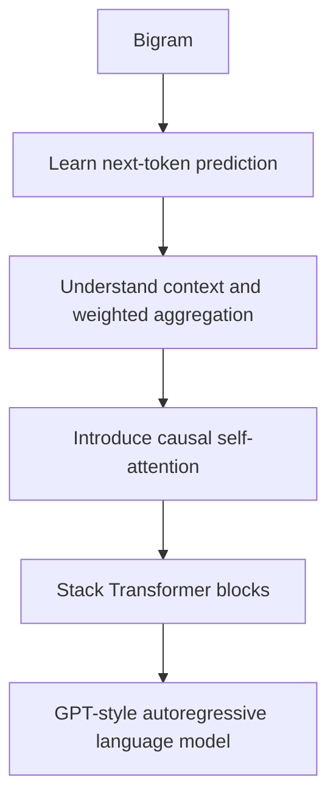
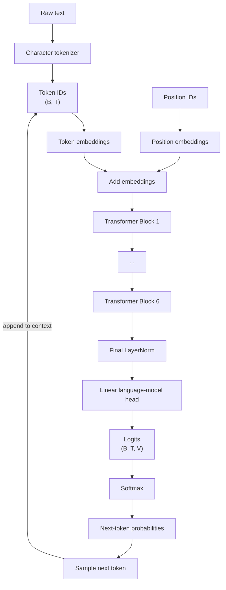
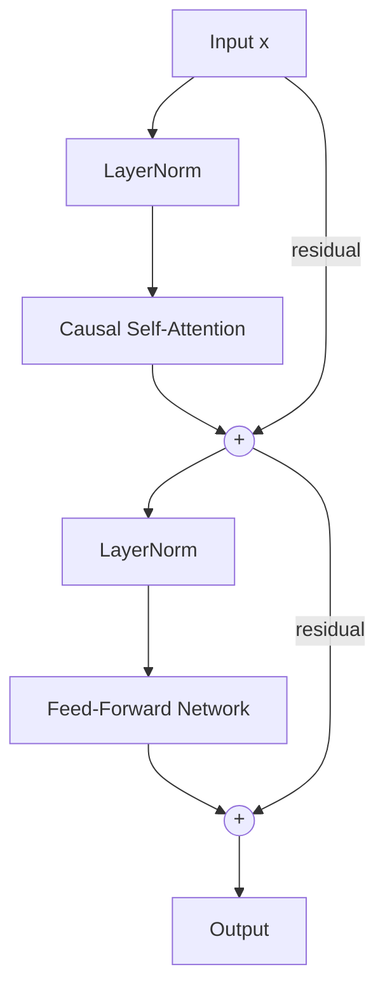
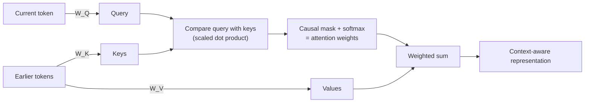
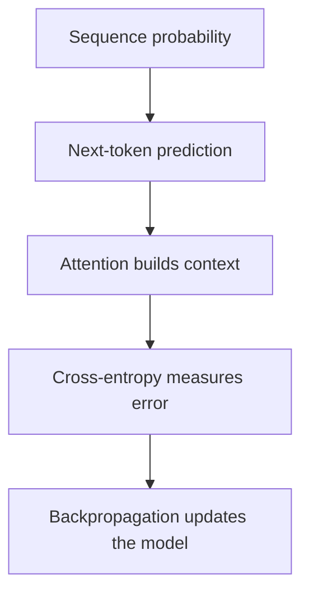

# GPT_from_scratch

A from-scratch GPT implementation progressing from a bigram model to self-attention and a decoder-only Transformer.

The goal of this repository is to make the core ideas behind GPT visible: how text becomes tokens, how a model learns to predict the next token, how self-attention lets tokens use earlier context, and how repeated predictions become generated text.

> **Learning path:** Start with the bigram model, move to the notebook to build intuition for attention, and finally explore the complete decoder-only Transformer implementation.

---

## What is GPT, in one idea?

At its core, GPT is an **autoregressive language model**.

Given a sequence of tokens

$$
x_1, x_2, \ldots, x_{t-1},
$$

the model predicts a probability distribution for the next token:

$$
P(x_t \mid x_1, x_2, \ldots, x_{t-1}).
$$

It then samples or selects one token, appends it to the sequence, and repeats the process:

```text
Context → Predict next token → Append token → Predict again → ...
```

This simple loop is the foundation of autoregressive text generation.

The model learns by maximizing the probability of the observed next tokens, or equivalently minimizing **cross-entropy / negative log-likelihood**:

$$
\mathcal{L} = -\frac{1}{T} \sum_{t=1}^{T} \log P_\theta(x_t \mid x_{\lt t}).
$$

---

## From a bigram model to GPT

This repository is organized as a progression rather than a single giant model.

| Stage | What it teaches | Deep dive |
|---|---|---|
| **01. Bigram** | Next-token prediction using only the previous character as context | [README](./01-bigram/README.md) |
| **02. Attention** | Tokenization, context windows, embeddings, weighted aggregation, causal masking, and self-attention | [README](./02-attention/README.md) |
| **03. GPT** | A complete decoder-only Transformer | [README](./03-gpt/README.md) |

The progression is intentional:



---

## The GPT architecture used here

The main implementation in [`03-gpt/gpt.py`](./03-gpt/gpt.py) is a **decoder-only Transformer** with:

- character-level tokenization
- token embeddings
- learned positional embeddings
- 6 Transformer blocks
- 6 attention heads per block
- embedding dimension of 384
- context window of 256 characters
- causal self-attention
- feed-forward networks
- residual connections
- LayerNorm
- dropout
- a final linear language-model head

These details correspond to the implementation documented in [`03-gpt/README.md`](./03-gpt/README.md).

### High-level data flow



### Inside one Transformer block

Each block applies attention and a feed-forward network, each preceded by LayerNorm and wrapped in a residual connection (the "pre-norm" pattern):



The complete implementation uses this pattern repeatedly across the Transformer stack.

---

## What makes self-attention important?

A bigram model only sees the immediately previous character:

$$
P(x_t \mid x_{t-1}).
$$

GPT-style attention can use the entire available context:

$$
P(x_t \mid x_1, x_2, \ldots, x_{t-1}).
$$

Self-attention does this by projecting token representations into **queries, keys, and values**:

$$
Q = XW_Q, \qquad K = XW_K, \qquad V = XW_V.
$$

The attention operation is

$$
\mathrm{Attention}(Q,K,V) = \mathrm{softmax}\left(\frac{QK^\top}{\sqrt{d_k}} + M\right)V,
$$

where $M$ is the **causal mask**. Future positions are masked so that a token cannot use information that would not yet exist during generation.

Conceptually:



The notebook [`02-attention/gpt-dev.ipynb`](./02-attention/gpt-dev.ipynb), documented in [`02-attention/README.md`](./02-attention/README.md), builds toward this idea step by step.

---

## From attention weights to probabilities

The model ultimately produces **logits**: unnormalized scores for every possible next token.

For logits $z_1, \ldots, z_V$, softmax converts them into probabilities:

$$
p_i = \frac{e^{z_i}}{\sum_{j=1}^{V} e^{z_j}}.
$$

The training target is the actual next token. Cross-entropy encourages the model to assign higher probability to that token.

During generation, the model can sample from the resulting distribution:

```text
logits → softmax → probability distribution → sample one token → append to context → repeat
```

---

## Training vs. generation

### During training

The model receives many context/target pairs at once:

```text
Input:  A B C D E
Target: B C D E F
```

For a sequence of length $T$, all next-token predictions can be trained in parallel because the causal mask prevents each position from seeing future tokens.

The training loop follows the standard pattern:

```text
sample batch → forward pass → calculate loss → backpropagation → update parameters
```

### During generation

Generation is autoregressive:

```text
Prompt → predict token → append token → predict token → append token → ...
```

The implementation keeps the most recent `block_size` tokens as the model context during generation.

---

## Why start with a bigram model?

The bigram model is deliberately tiny.

It uses a learned table where the previous character directly determines a distribution over the next character:

$$
P(x_t \mid x_{t-1}).
$$

This makes the core language-modeling objective easy to see:

> **Given context, predict the next token.**

GPT extends this idea by replacing the extremely limited bigram context with learned, context-dependent representations built using self-attention.

See [`01-bigram/README.md`](./01-bigram/README.md) for the implementation details.

---

## Quick start

Install the dependencies:

```bash
pip install -r requirements.txt
```

Then explore the bigram model:

```bash
python 01-bigram/bigram.py
```

Or run the complete GPT implementation:

```bash
python 03-gpt/gpt.py
```

Open the attention notebook with Jupyter:

```text
02-attention/gpt-dev.ipynb
```

---

## A few useful equations

### 1. Autoregressive factorization

A language model decomposes the probability of a sequence as

$$
P(x_1,\ldots,x_T) = \prod_{t=1}^{T} P(x_t \mid x_{\lt t}).
$$

### 2. Scaled dot-product attention

$$
\mathrm{Attention}(Q,K,V) = \mathrm{softmax}\left(\frac{QK^\top}{\sqrt{d_k}} + M\right)V.
$$

### 3. Next-token loss

$$
\mathcal{L} = -\frac{1}{T} \sum_{t=1}^{T} \log P_\theta(x_t \mid x_{\lt t}).
$$

These three ideas connect much of the implementation:



---

## Where to go next

For the conceptual route:

[`01-bigram/README.md`](./01-bigram/README.md) → [`02-attention/README.md`](./02-attention/README.md) → [`03-gpt/README.md`](./03-gpt/README.md)

To jump straight into the complete implementation:

[`03-gpt/gpt.py`](./03-gpt/gpt.py) → [`03-gpt/README.md`](./03-gpt/README.md)
