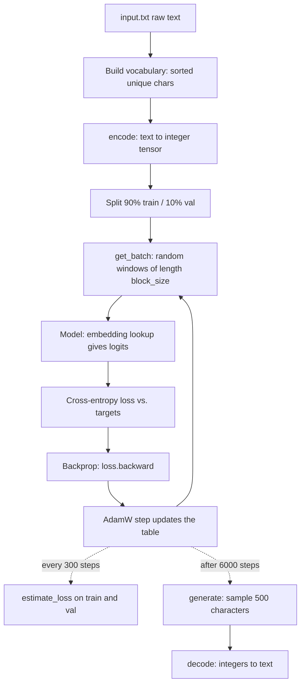

# Character-Level Bigram Language Model (PyTorch)

A minimal, from-scratch **character-level bigram language model** written in PyTorch. It is the first building block on the road to a GPT-style Transformer: it introduces the full training and sampling pipeline (tokenization, batching, loss, optimization, evaluation, autoregressive generation) using the simplest possible model. Every piece except the model itself carries over unchanged to a real GPT.

> **Goal:** understand *every line* of a language-modelling pipeline before adding self-attention.

---

## Table of Contents

1. [Overview](#1-overview)
2. [Quick Start](#2-quick-start)
3. [Pipeline at a Glance](#3-pipeline-at-a-glance)
4. [Background: What Is a Language Model?](#4-background-what-is-a-language-model)
5. [Code Walkthrough](#5-code-walkthrough)
   - 5.1 [Imports](#51-imports)
   - 5.2 [Hyperparameters](#52-hyperparameters)
   - 5.3 [Reproducibility and Device](#53-reproducibility-and-device)
   - 5.4 [Loading the Data](#54-loading-the-data)
   - 5.5 [Tokenization](#55-tokenization-characters--integers)
   - 5.6 [Train / Validation Split](#56-train--validation-split)
   - 5.7 [Batching: `get_batch`](#57-batching-get_batch)
   - 5.8 [Loss Estimation: `estimate_loss`](#58-loss-estimation-estimate_loss)
   - 5.9 [The Model: `BigramLanguageModel`](#59-the-model-bigramlanguagemodel)
   - 5.10 [Generation: `generate`](#510-generation-generate)
   - 5.11 [Optimizer](#511-optimizer-adamw)
   - 5.12 [The Training Loop](#512-the-training-loop)
   - 5.13 [Sampling From the Trained Model](#513-sampling-from-the-trained-model)
6. [Core Concepts in Depth](#6-core-concepts-in-depth)
7. [Tensor Shape Cheat Sheet](#7-tensor-shape-cheat-sheet)
8. [What to Expect When You Run It](#8-what-to-expect-when-you-run-it)
9. [Limitations of the Bigram Model](#9-limitations-of-the-bigram-model)
10. [Known Quirks and Possible Improvements](#10-known-quirks-and-possible-improvements)
11. [Experiments to Try](#11-experiments-to-try)
12. [Roadmap: From Bigram to GPT](#12-roadmap-from-bigram-to-gpt)
13. [Glossary](#13-glossary)
14. [References](#14-references)

---

## 1. Overview

This script trains a neural network to predict **the next character** given **the current character**, then uses it to generate new text one character at a time.

| Property | Value |
|---|---|
| Framework | PyTorch |
| Tokenization | Character-level (each unique character is a token) |
| Model | Single `nn.Embedding` lookup table of size `vocab_size × vocab_size` |
| Context actually used for prediction | **1 character** (the previous one) |
| Loss | Cross-entropy (negative log-likelihood) |
| Optimizer | AdamW |
| Task | Autoregressive next-token prediction |

The model is deliberately "dumb": it has no memory beyond the last character. That's the point. It gives us a working end-to-end baseline and a concrete loss number to beat when we add attention.

---

## 2. Quick Start

### Requirements

- Python 3.8+
- PyTorch (`pip install torch`)
- A text file called `input.txt` in the same directory

### Get a dataset

The code is written with the **Tiny Shakespeare** dataset (~1.1 MB of concatenated Shakespeare plays, roughly 65 unique characters) in mind:

```bash
curl -O https://raw.githubusercontent.com/karpathy/char-rnn/master/data/tinyshakespeare/input.txt
```

Any plain UTF-8 text file works. Only the vocabulary size and the loss values will differ.

### Run

```bash
python bigram.py
```

You will see the train and validation loss printed every 300 steps, followed by 500 generated characters.

---

## 3. Pipeline at a Glance



In words:

1. Read text, build a vocabulary, turn the text into a long tensor of integers.
2. Repeatedly sample small random chunks, ask the model to predict the next character at every position, measure how wrong it is (cross-entropy), and nudge the weights (AdamW).
3. Periodically measure loss on held-out data to check that the model is generalizing.
4. Finally, sample from the model autoregressively to produce text.

---

## 4. Background: What Is a Language Model?

A **language model** assigns a probability to a sequence of tokens. Using the chain rule of probability, any sequence $x_1, x_2, \dots, x_T$ factorizes exactly as:

$$
P(x_1, \dots, x_T) = \prod_{t=1}^{T} P(x_t \mid x_1, \dots, x_{t-1})
$$

This is called an **autoregressive** factorization: each token is predicted from all the tokens before it. A GPT models each factor $P(x_t \mid x_{<t})$ with a Transformer that can look at the whole prefix.

A **bigram** model makes a strong simplifying assumption (the *Markov assumption*): the next token depends **only on the immediately preceding token**:

$$
P(x_t \mid x_1, \dots, x_{t-1}) \approx P(x_t \mid x_{t-1})
$$

So the whole model is a table of conditional probabilities: for each possible current character, a probability distribution over the next character. With a vocabulary of size $V$ that is a $V \times V$ table.

```
              next char →
            a     b     c   ...   z
current  a [0.01 0.05 0.03 ... 0.00]   ← row = distribution over next char given 'a'
char     b [0.10 0.00 0.01 ... 0.00]
   ↓     c [ ...                     ]
        ...
```

Classically you'd estimate this table by counting how often each pair occurs. Here we instead **learn** the table with gradient descent, which is exactly the same machinery a deep network uses. Counting gives the optimum directly. Gradient descent approaches the same optimum, and, unlike counting, the training setup scales to models that can't be counted.

---

## 5. Code Walkthrough

### 5.1 Imports

```python
import torch
import torch.nn as nn
from torch.nn import functional as F
```

- `torch`: the tensor library (multi-dimensional arrays with GPU support and automatic differentiation).
- `torch.nn` (as `nn`): building blocks for neural networks: `nn.Module`, `nn.Embedding`, `nn.Linear`, etc.
- `torch.nn.functional` (as `F`): stateless functions such as `F.cross_entropy` and `F.softmax`. Anything without learnable parameters usually lives here.

---

### 5.2 Hyperparameters

```python
batch_size = 32
block_size = 8
max_iters = 6000
eval_interval = 300
learning_rate = 1e-3
device = "cuda" if torch.cuda.is_available() else "cpu"
eval_iters = 200
```

**Hyperparameters** are settings *you* choose, as opposed to **parameters** (weights) that training learns.

| Name | Value | Meaning |
|---|---|---|
| `batch_size` | 32 | How many independent sequences are processed in parallel per training step. Larger batches give less noisy gradients but need more memory. |
| `block_size` | 8 | The **context length**: how many consecutive characters are in each training sequence. In a Transformer it's the maximum context the model can attend to. *See the note below: a bigram model doesn't actually use it for prediction.* |
| `max_iters` | 6000 | Total number of optimizer updates (training steps). |
| `eval_interval` | 300 | Evaluate train/val loss every 300 steps. |
| `learning_rate` | 1e-3 | Step size of the optimizer. `1e-3` is fairly high, which is fine for such a tiny model. Large Transformers typically use smaller rates (e.g. 3e-4 or lower). |
| `device` | cuda / cpu | Where tensors and the model live. GPU if available, otherwise CPU. |
| `eval_iters` | 200 | Number of batches averaged when estimating loss. More batches means a smoother, more reliable estimate. |

> **Important nuance about `block_size`.** The model only reads *one* token to predict the next. So in the bigram model `block_size` only controls **how many training examples you get per sequence** (`block_size` predictions per row), not how much context the model can use. It becomes a genuine "context window" only once we add self-attention.

**Tokens seen per step:** `batch_size × block_size = 32 × 8 = 256` predictions per training step. Over 6000 steps that is about 1.5 million predictions, which is only slightly more than one pass over a ~1M-character training set.

---

### 5.3 Reproducibility and Device

```python
torch.manual_seed(1337)
```

Seeds PyTorch's random number generator so that weight initialization and random batch sampling are the same on every run (on the same hardware and PyTorch version). This is what makes results comparable when you tweak one thing at a time. The number itself (`1337`) is arbitrary.

The `device` variable is used throughout. Each tensor that participates in a computation must live on the same device as the model, which is why `get_batch` calls `.to(device)` and the model is moved with `model.to(device)`.

---

### 5.4 Loading the Data

```python
with open("input.txt", "r", encoding="utf-8") as f:
    text = f.read()
```

Reads the whole file into one Python string. The `with` block guarantees the file is closed afterwards, and `encoding="utf-8"` avoids platform-dependent decoding surprises. At this scale (about a megabyte), holding everything in memory is trivially fine.

---

### 5.5 Tokenization: Characters → Integers

Neural networks operate on numbers, not strings. **Tokenization** is the mapping between text and integers.

```python
chars = sorted(list(set(text)))
vocab_size = len(chars)
stoi = {ch: i for i, ch in enumerate(chars)}
itos = {i: ch for i, ch in enumerate(chars)}

def encode(s):
    return [stoi[c] for c in s]

def decode(indices):
    return "".join([itos[i] for i in indices])
```

Step by step:

1. `set(text)` collects the unique characters. `sorted(...)` puts them in a deterministic order (so the same file always yields the same mapping).
2. `vocab_size = len(chars)` is the number of distinct tokens ($V$). For Tiny Shakespeare it's 65 (letters, digits are absent, but punctuation, whitespace and newline are present).
3. `stoi` ("string to integer") and `itos` ("integer to string") are lookup dictionaries in each direction.
4. `encode("hi")` returns a list of ints, and `decode(...)` reverses it exactly. This is a **lossless** round-trip.

**Why character-level?** It's the simplest possible tokenizer: tiny vocabulary, no external library, no out-of-vocabulary problem. The trade-off is that sequences become long (one token per character) and each token carries little meaning.

**What real GPTs do instead:** *subword tokenization* such as Byte-Pair Encoding (BPE), with vocabularies of roughly 50,000 tokens (e.g. GPT-2 uses 50,257). Longer tokens pack more meaning per position, so the same text needs fewer positions, but the embedding table becomes larger. This matters for our model. A bigram table with a 50k vocabulary would be $50{,}257^2 \approx 2.5$ billion parameters, which is one reason real models use a small embedding dimension followed by a projection rather than a $V \times V$ table.

---

### 5.6 Train / Validation Split

```python
data = torch.tensor(encode(text), dtype=torch.long)
n = int(0.9 * len(data))
train_data = data[:n]
val_data = data[n:]
```

- The entire text becomes a 1-D `torch.long` (int64) tensor of shape `(N,)`. `long` is required because these integers are used as *indices* into an embedding table.
- The first 90% is training data; the last 10% is **validation** data the model never trains on.

**Why validate?** Training loss alone can look great simply because the model memorized the training set (**overfitting**). Validation loss measures how well it generalizes to unseen text. If train loss keeps falling while val loss rises, you're overfitting. For this tiny bigram model the two stay very close, since a table with only $V^2$ numbers can't memorize much.

The split is *contiguous* (not shuffled). For text that's the right choice. You want validation to be a genuinely different passage, not sentences interleaved with training text.

---

### 5.7 Batching: `get_batch`

```python
def get_batch(split):
    data = train_data if split == "train" else val_data
    ix = torch.randint(len(data) - block_size, (batch_size,))
    x = torch.stack([data[i : i + block_size] for i in ix])
    y = torch.stack([data[i + 1 : i + block_size + 1] for i in ix])
    x, y = x.to(device), y.to(device)
    return x, y
```

This function produces one **mini-batch** of inputs `x` and targets `y`, each of shape `(batch_size, block_size)` = `(B, T)`.

**Line by line**

1. Choose the train or validation tensor. (This local `data` shadows the global `data`. See [quirks](#10-known-quirks-and-possible-improvements).)
2. `torch.randint(high, size)` draws `batch_size` random integers in `[0, high)`. These are random **starting offsets** into the text. Subtracting `block_size` guarantees that the slice `i+1 : i+block_size+1` never runs past the end of the data.
3. For every offset `i`, `x` takes `data[i : i+block_size]`, a window of `block_size` consecutive tokens.
4. `y` takes the *same window shifted right by one*: `data[i+1 : i+block_size+1]`. So `y[b, t]` is the token that comes right after `x[b, t]`.
5. `torch.stack` combines the list of 1-D tensors into one 2-D tensor.
6. `.to(device)` moves the batch to the GPU (if available).

**The key idea: one window = many training examples**

A window of length 8 contains 8 separate "given this, predict that" examples. Take the text "First Ci":

```
x = [ F , i , r , s , t , ' ' , C , i ]
y = [ i , r , s , t , ' ' , C , i , t ]     (each y is the next character after x)

Example 1: input 'F'         → target 'i'
Example 2: input 'i'         → target 'r'
Example 3: input 'r'         → target 's'
   ...
Example 8: input 'i'         → target 't'
```

For a **bigram** model each example only uses the single input character. For a **Transformer**, example *t* would use the whole prefix `x[0..t]` as context. Using the same batching code for both is why this pipeline transfers to GPT unchanged. Training on every context length from 1 to `block_size` also means the model is used to short contexts at generation time, when a prompt may be only one token long.

**Sampling notes:** offsets are drawn *with replacement* and windows may overlap. There are no "epochs" here: each step is an independent random sample of the data.

---

### 5.8 Loss Estimation: `estimate_loss`

```python
@torch.no_grad()
def estimate_loss():
    out = {}
    model.eval()
    for split in ["train", "val"]:
        losses = torch.zeros(eval_iters)
        for k in range(eval_iters):
            X, Y = get_batch(split)
            logits, loss = model(X, Y)
            losses[k] = loss.item()
        out[split] = losses.mean()
    model.train()
    return out
```

The loss on a single mini-batch is noisy. It depends on which 32 windows happened to be drawn. To get a stable number, we average the loss over `eval_iters = 200` batches for each split.

- `@torch.no_grad()`: disables gradient tracking inside the function. We only want to *measure*, not train, so PyTorch skips building the autograd graph, which saves memory and time.
- `model.eval()` / `model.train()`: switch the model between evaluation and training modes. Layers such as **Dropout** and **BatchNorm** behave differently in each. This bigram model has no such layers, so it makes no functional difference *now*, but it's the correct habit and becomes necessary in a full GPT.
- `loss.item()`: converts a one-element tensor to a plain Python float.
- The function returns a dict like `{"train": tensor(2.47), "val": tensor(2.50)}`.

Each evaluation uses `200 × 32 × 8 = 51,200` predictions per split, which is enough for a stable estimate.

---

### 5.9 The Model: `BigramLanguageModel`

```python
class BigramLanguageModel(nn.Module):
    def __init__(self, vocab_size):
        super().__init__()
        self.token_embedding_table = nn.Embedding(vocab_size, vocab_size)

    def forward(self, idx, targets=None):
        logits = self.token_embedding_table(idx)  # (B,T,C)

        if targets is None:
            loss = None
        else:
            B, T, C = logits.shape
            logits = logits.view(B * T, C)
            targets = targets.view(B * T)
            loss = F.cross_entropy(logits, targets)

        return logits, loss
```

#### `nn.Module`

The base class for all PyTorch models. It tracks parameters (anything registered as a sub-module or `nn.Parameter`), lets you call `model(x)` (which dispatches to `forward`), and supports `.to(device)`, `.parameters()`, `.train()`/`.eval()`, saving, etc. `super().__init__()` must be called first.

#### `nn.Embedding(vocab_size, vocab_size)`

An embedding layer is a **learnable lookup table**: a matrix of shape `(num_embeddings, embedding_dim)` where row `i` is the vector for token `i`. Calling it with an integer tensor of indices returns the matching rows:

```
                      embedding table (V × V)
token id 0  →  row 0: [ w00  w01  w02 ... w0V ]
token id 1  →  row 1: [ w10  w11  w12 ... w1V ]
token id 2  →  row 2: [ w20  w21  w22 ... w2V ]
   ...
```

Here the embedding dimension is deliberately set equal to `vocab_size`, so that **row `i` directly holds the logits for the next character given that the current character is `i`**. No further layer is needed. In the GPT we'll build later, the embedding dimension will be much smaller (e.g. 32 to 768 or more) and a separate `nn.Linear` will project back up to `vocab_size` logits.

- **Parameter count:** $V \times V$. For $V = 65$ that's just 4,225 weights.
- Equivalent to multiplying a one-hot vector by a matrix, but done efficiently as an indexed lookup.
- **Initial values:** drawn from a standard normal $\mathcal{N}(0, 1)$.

#### `forward(idx, targets=None)`

- `idx`: integer tensor `(B, T)`, a batch of token sequences.
- `targets`: integer tensor `(B, T)`, the correct next tokens, or `None` at generation time.
- `logits = self.token_embedding_table(idx)` returns a `(B, T, C)` tensor, where `C = vocab_size`. For every position in every sequence we get a vector of `C` **logits**: raw, unnormalized scores for each possible next character.

**What is a logit?** A real number, positive or negative, where higher means "more likely". Logits become probabilities through the softmax function:

$$
p_i = \frac{e^{z_i}}{\sum_{j} e^{z_j}}
$$

#### Reshaping for the loss

`F.cross_entropy` expects logits of shape `(N, C)` and targets of shape `(N,)` (class indices). Our tensors are `(B, T, C)` and `(B, T)`, so we flatten the batch and time dimensions together:

```python
logits  = logits.view(B * T, C)    # (B*T, C)
targets = targets.view(B * T)      # (B*T,)
```

Each of the `B*T` positions becomes one independent classification problem. `.view` reinterprets the same memory with a new shape (no copy), which requires a contiguous tensor. Here that holds; `.reshape` is the safer alternative.

> **API quirk:** when `targets` is given, the returned `logits` are the *flattened* `(B*T, C)` version. When `targets is None`, they stay `(B, T, C)`. `generate` relies on that.

#### Cross-entropy loss

```python
loss = F.cross_entropy(logits, targets)
```

Combines **softmax** and **negative log-likelihood** in one numerically stable operation. For one example with correct class $y$:

$$
\mathcal{L} = -\log p_y = -\log \frac{e^{z_y}}{\sum_j e^{z_j}}
$$

The loss is small when the model assigns high probability to the true next character and large when it assigns low probability. The reported loss is the **mean** over all `B*T` examples.

**A useful sanity check:** before any training, if the model were perfectly uniform over `V = 65` characters, the loss would be

$$
-\ln(1/65) = \ln 65 \approx 4.17
$$

Because the embedding weights start as random $\mathcal{N}(0,1)$, the initial predictions are *not* perfectly uniform, so the starting loss is somewhat higher than 4.17. If it's wildly above that, something is wrong. This "expected initial loss" check is a classic debugging trick.

**Connection to information theory:** cross-entropy in nats is the average "surprise" of the true data under the model's predicted distribution. Perplexity is $e^{\text{loss}}$, the effective number of characters the model is "choosing between" at each step. A loss of 2.5 is a perplexity of about 12.

---

### 5.10 Generation: `generate`

```python
def generate(self, idx, max_new_tokens):
    for _ in range(max_new_tokens):
        logits, loss = self(idx)
        logits = logits[:, -1, :]                       # (B, C)
        probs = F.softmax(logits, dim=-1)               # (B, C)
        idx_next = torch.multinomial(probs, num_samples=1)  # (B, 1)
        idx = torch.cat((idx, idx_next), dim=1)         # (B, T+1)
    return idx
```

This is **autoregressive sampling**: generate one token, append it to the sequence, feed the longer sequence back in, repeat.

Each iteration:

1. **Forward pass**: `self(idx)` returns logits of shape `(B, T, C)` (targets are `None`, so the logits aren't flattened).
2. **Take the last time step**: `logits[:, -1, :]` keeps only the prediction for the *next* token after the current end of the sequence, shape `(B, C)`. The other `T-1` predictions are for positions that already exist and are discarded.
3. **Softmax**: turns logits into a probability distribution over the vocabulary (`dim=-1` normalizes across the `C` classes so each row sums to 1).
4. **Sample**: `torch.multinomial(probs, num_samples=1)` draws one token index from each row's distribution. Likely characters are picked more often, but not always. That randomness is what makes the output varied instead of repeating the same text.
5. **Append**: `torch.cat((idx, idx_next), dim=1)` extends every sequence in the batch by one token.

**Sampling vs. greedy decoding.** Taking `argmax` instead of sampling would be deterministic. It would quickly loop on the single most likely path (e.g. repeating the same pair of characters). Sampling preserves the diversity of the learned distribution.

**Why feed the whole sequence if the bigram model only needs the last token?** Because the interface is designed to carry over to a Transformer, where the full context matters. For the bigram model it's wasted computation, harmless at this scale. (When you move to attention, you'll also need to crop `idx` to the last `block_size` tokens so it never exceeds the context window.)

---

### 5.11 Optimizer (AdamW)

```python
model = BigramLanguageModel(vocab_size)
m = model.to(device)
optimizer = torch.optim.AdamW(model.parameters(), lr=learning_rate)
```

- `model.to(device)` moves all parameters to the GPU/CPU. For `nn.Module`, `.to()` modifies the module in place and returns it, so `m` and `model` refer to the **same** object.
- **AdamW** is the standard optimizer for Transformers. Compared with plain SGD ($\theta \leftarrow \theta - \eta \nabla \mathcal{L}$):
  - It keeps a running average of each parameter's gradient (**momentum**, first moment) and of the squared gradient (**second moment**), and scales each parameter's step by the inverse of the RMS of recent gradients. This gives every weight its own adaptive learning rate.
  - The "W" means **decoupled weight decay**: the regularization shrinkage is applied directly to weights rather than being mixed into the gradient (as in the original Adam with L2 regularization). The default weight decay in PyTorch is `0.01`.
- `model.parameters()` hands the optimizer the tensors to update. Here that's just the single embedding matrix.

---

### 5.12 The Training Loop

```python
for iter in range(max_iters):
    if iter % eval_interval == 0:
        losses = estimate_loss()
        print(f"step {iter}: train loss {losses['train']:.4f}, val loss {losses['val']:.4f}")

    xb, yb = get_batch("train")

    logits, loss = model(xb, yb)
    optimizer.zero_grad(set_to_none=True)
    loss.backward()
    optimizer.step()
```

The canonical five-step PyTorch training recipe, repeated 6000 times:

| Step | Code | What happens |
|---|---|---|
| 1. Sample | `xb, yb = get_batch("train")` | Draw a random mini-batch of training data. |
| 2. Forward | `logits, loss = model(xb, yb)` | Compute predictions and the scalar loss. PyTorch records every operation to build a computation graph. |
| 3. Zero grads | `optimizer.zero_grad(set_to_none=True)` | Clear gradients left over from the previous step. PyTorch **accumulates** gradients by default, so you must reset them. `set_to_none=True` sets them to `None` rather than zero-filled tensors, which is slightly faster and uses less memory. |
| 4. Backward | `loss.backward()` | **Backpropagation**: walks the graph in reverse using the chain rule, filling `param.grad` with $\partial \mathcal{L} / \partial \theta$ for every parameter. |
| 5. Update | `optimizer.step()` | Applies the AdamW update rule to each parameter using its gradient. |

**Gradient descent in one sentence:** the gradient tells us how a tiny change in each weight would change the loss; we nudge every weight slightly in the direction that *decreases* the loss.

**For this model specifically**, the gradient of the loss with respect to the logits of one example is famously simple:

$$
\frac{\partial \mathcal{L}}{\partial z_i} = p_i - \mathbb{1}[i = y]
$$

("predicted probability minus one-hot target"). Only the table row of the *input* character receives a gradient for that example. Its logits are pushed up for the correct next character and down for all others. Over many examples, each row converges toward the empirical distribution of characters that follow the given character in the training text.

**Mini-batch stochastic gradient descent (SGD):** we never compute the gradient over the whole dataset, only on a random batch. The gradient is noisy but cheap, and on average points the right way.

**Evaluation cadence:** loss is evaluated at steps 0, 300, 600, ..., 5700. Step 0 shows the loss of the untrained model. Because the loop is `range(6000)`, the last evaluation happens at step 5700 and there is no evaluation after the final update.

---

### 5.13 Sampling From the Trained Model

```python
context = torch.zeros((1, 1), dtype=torch.long, device=device)
print(decode(m.generate(context, max_new_tokens=500)[0].tolist()))
```

- `torch.zeros((1, 1), dtype=torch.long)` creates a batch of one sequence containing a single token: **token id 0**. With a sorted vocabulary that is usually the newline character `\n` on Tiny Shakespeare. So generation starts "at the beginning of a line".
- `m.generate(context, max_new_tokens=500)` returns a `(1, 501)` tensor (the seed token plus 500 new ones).
- `[0]` selects the first (only) sequence in the batch, `.tolist()` converts it to a Python list of ints, and `decode` turns it back into a string.

---

## 6. Core Concepts in Depth

A compact reference for every idea this file touches.

### 6.1 Tensors and shapes

A **tensor** is an n-dimensional array. Almost all bugs in deep learning code are shape bugs, so this code annotates shapes in comments:

- **B** = batch size, **T** = time (sequence length), **C** = channels/classes (here, vocabulary size).
- `(B, T)` integer token ids, and `(B, T, C)` per-position score vectors.

### 6.2 Embeddings

A learnable table mapping discrete ids to vectors. Training adjusts the table so that the vectors become useful for the task. In a bigram model the vector *is* the prediction; in a Transformer it's a dense representation that later layers process.

### 6.3 Logits, softmax, and probabilities

Neural nets output unconstrained real numbers (logits). Softmax exponentiates and normalizes them into a valid probability distribution (non-negative, sums to 1). Working with logits during training is more numerically stable, which is why `F.cross_entropy` takes logits, not probabilities.

### 6.4 Cross-entropy and maximum likelihood

Minimizing cross-entropy is equivalent to **maximum-likelihood estimation**: choosing parameters that make the observed data most probable under the model. Because the model is autoregressive, the negative log-likelihood of a whole sequence is just the sum of per-token cross-entropies (which is what we average).

### 6.5 Autograd and backpropagation

PyTorch records operations on tensors that require gradients (all `nn.Parameter`s do) and, on `loss.backward()`, applies the chain rule automatically. You never write derivatives by hand.

### 6.6 Optimization

Gradient-based optimization with mini-batches and an adaptive optimizer (AdamW). The learning rate controls step size: too small and training crawls; too large and the loss oscillates or diverges.

### 6.7 Generalization: train vs. validation loss

Training loss says how well the model fits what it's seen. Validation loss estimates how well it will do on new data. Always report the latter.

### 6.8 Autoregressive generation

Use the model's own output as the next input. Errors can compound, since one unlikely character changes everything downstream, but it's the same mechanism used by ChatGPT-style models.

### 6.9 Sampling

Drawing from the predicted distribution (`torch.multinomial`) rather than always picking the most likely token. Common extensions, not implemented here, are **temperature** (divide logits by $\tau$ before softmax; $\tau<1$ is more conservative, $\tau>1$ more random), **top-k**, and **top-p (nucleus)** sampling.

### 6.10 The bigram model as a Markov chain

Once trained, the table is a **first-order Markov chain** over characters. The generated text is a random walk on that chain. This is why the output looks locally plausible (pairs of letters resemble English) but has no global structure.

### 6.11 The theoretical best for this model

The lowest loss any bigram model can achieve on a dataset is the **conditional entropy** $H(X_t \mid X_{t-1})$ of the data. Gradient descent on the table converges toward the count-based estimates, so on Tiny Shakespeare the loss levels off at roughly 2.5 and cannot go meaningfully lower no matter how long you train. Improving beyond that requires the model to see *more than one* previous character.

---

## 7. Tensor Shape Cheat Sheet

| Tensor | Shape | Notes |
|---|---|---|
| `data` (encoded text) | `(N,)` | `torch.long`, all characters as ids |
| `train_data` / `val_data` | `(0.9N,)` / `(0.1N,)` | contiguous split |
| `ix` | `(B,)` | random starting offsets |
| `x`, `y` (batch) | `(B, T)` | `y` is `x` shifted left by one position |
| `token_embedding_table.weight` | `(V, V)` | the entire "model" |
| `logits` (from embedding) | `(B, T, V)` | one score vector per position |
| `logits` (after `.view`) | `(B*T, V)` | for `F.cross_entropy` |
| `targets` (after `.view`) | `(B*T,)` | class indices |
| `loss` | `()` scalar | mean cross-entropy |
| `idx` in `generate` | `(B, T)` → `(B, T+max_new_tokens)` | grows each iteration |
| `logits[:, -1, :]` | `(B, V)` | last position only |
| `probs` | `(B, V)` | rows sum to 1 |
| `idx_next` | `(B, 1)` | one sampled token per sequence |

*(with B = batch size, T = block size, V = vocab size, N = dataset length in characters.)*

---

## 8. What to Expect When You Run It

Approximate behavior on Tiny Shakespeare (exact numbers vary with hardware and PyTorch version):

| Phase | Approx. loss |
|---|---|
| Step 0 (random weights) | a bit above 4.17 (uniform-guess baseline: ln 65 ≈ 4.17) |
| Early training | drops quickly |
| Late training (a few thousand steps) | levels off around **2.5** |
| Train vs. val | very close to each other (little overfitting) |

Generated text will look like English-flavored gibberish: plausible letter pairs, roughly word-like clumps, a few short real words, and no grammar or meaning. That is the bigram limit made visible.

Training takes seconds to a minute or two on a laptop CPU, so it's cheap to experiment.

---

## 9. Limitations of the Bigram Model

1. **One-token memory.** It predicts using only the previous character, so `q` is followed by whatever typically follows `q` regardless of what came before it.
2. **No long-range structure.** No words, sentences, or coherence beyond adjacent character pairs.
3. **Fixed loss floor.** Extra training cannot push it below the conditional-entropy limit of about 2.5.
4. **Context ignored.** `block_size` is used only for batching, not for modelling.
5. **Quadratic table size.** Parameters grow as $V^2$, which is infeasible for large vocabularies.
6. **No position information and no token interaction.** Tokens never "talk" to each other, which is exactly what self-attention adds.

---

## 10. Known Quirks and Possible Improvements

Small things in the current code that are worth knowing, and easy upgrades:

| Item | Detail | Suggestion |
|---|---|---|
| `generate` tracks gradients | It isn't decorated with `@torch.no_grad()`, so autograd builds a graph unnecessarily during sampling. | Decorate `generate` with `@torch.no_grad()` or call it inside `with torch.no_grad():`. |
| Unused `loss` in `generate` | `logits, loss = self(idx)` never uses `loss`. | Use `logits, _ = self(idx)`. |
| Shadowed names | `data` is reused inside `get_batch`, and `iter` shadows a Python built-in. | Rename to `split_data` and `step`. |
| `estimate_loss` uses global `model` | Works, but couples the function to global state. | Pass `model` as an argument. |
| No final evaluation | Last eval is at step 5700. | Run `estimate_loss()` once after the loop. |
| No checkpointing | The trained table is lost when the script exits. | `torch.save(model.state_dict(), "bigram.pt")`. |
| Only random batches | No true epochs. | Fine for now, but keep in mind when comparing to other codebases. |
| Sampling has no controls | No temperature or top-k. | Add a `temperature` argument (divide logits before softmax). |
| Redundant `m` | `m = model.to(device)` is an alias of `model`. | Use one name. |
| Full-context forward in `generate` | Recomputes all positions each step. | Irrelevant for bigram; matters for Transformers (KV cache). |

---

## 11. Experiments to Try

Learning happens by poking at things:

1. **Change the seed** and confirm the results vary only slightly.
2. **Train longer or shorter** (`max_iters`) and watch where the loss plateaus.
3. **Raise / lower `learning_rate`** (e.g. `1e-2`, `1e-4`) and observe convergence speed and stability.
4. **Change `block_size`.** The bigram *model* is unaffected, but the number of predictions per step changes.
5. **Compare against pure counting.** Build a `V × V` count matrix from the training data, normalize rows, and compute its cross-entropy on validation data. It should closely match the trained model's loss.
6. **Print the initial loss** and compare with $\ln V$.
7. **Sample with different starting characters** by changing `context`.
8. **Implement temperature** in `generate` and compare outputs at 0.5, 1.0, 1.5.
9. **Try a different text** (code, another language, song lyrics) and see how the vocabulary size and loss floor change.
10. **Inspect the learned table:** `model.token_embedding_table.weight` after `F.softmax(..., dim=-1)` gives the transition matrix. Plot it as a heatmap.

---

## 12. Roadmap: From Bigram to GPT

Each step below builds directly on this file:

1. **Separate embedding dimension:** `nn.Embedding(vocab_size, n_embd)` followed by `nn.Linear(n_embd, vocab_size)`. Decouples model width from vocabulary size.
2. **Positional embeddings:** tell the model *where* in the sequence each token is.
3. **Self-attention:** let each token gather information from previous tokens using a causal (lower-triangular) mask, so the model can use the whole `block_size` context.
4. **Multi-head attention:** several attention "channels" in parallel.
5. **Feed-forward layers:** per-token computation after communication.
6. **Residual connections and LayerNorm:** make deep stacks trainable.
7. **Stack into Transformer blocks** and add **dropout** for regularization.
8. **Scale up:** larger `n_embd`, more layers and heads, longer `block_size`, GPU training, better tokenizer (BPE).

The data pipeline, loss, optimizer, evaluation, and generation loop in this repo stay essentially the same. Only `BigramLanguageModel` changes.

---

## 13. Glossary

| Term | Meaning |
|---|---|
| **Token** | The unit the model reads and predicts (here: one character). |
| **Vocabulary** | The set of all possible tokens; size $V$. |
| **Embedding** | A learnable vector (or table of vectors) for each token id. |
| **Logits** | Raw, unnormalized scores output by the model. |
| **Softmax** | Function turning logits into probabilities. |
| **Cross-entropy** | Loss comparing predicted probabilities to the true class. |
| **Perplexity** | $e^{\text{loss}}$; effective number of equally likely choices per step. |
| **Batch** | A group of sequences processed together. |
| **Block size / context length** | Number of tokens per training sequence. |
| **Autoregressive** | Predicts each token from the ones before it. |
| **Epoch** | One full pass over the dataset (not used explicitly here). |
| **Overfitting** | Fitting the training data so closely that performance on new data suffers. |
| **Backpropagation** | Efficient computation of gradients via the chain rule. |
| **Optimizer** | Algorithm that updates weights from gradients (here AdamW). |
| **Markov chain** | A process where the next state depends only on the current one. |

---
